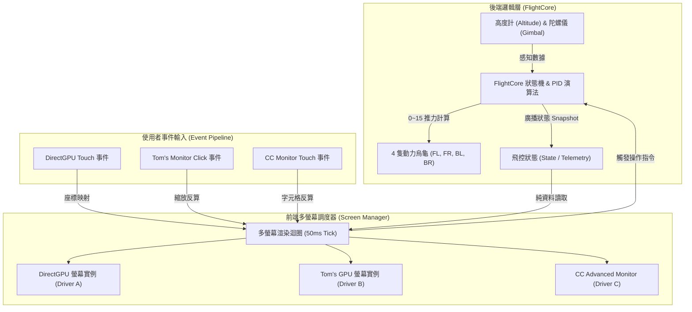
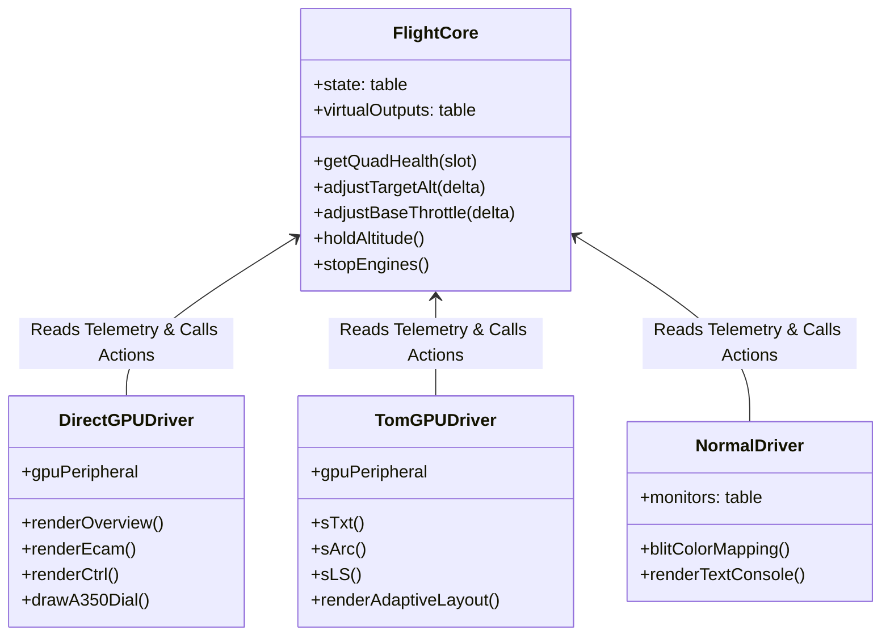
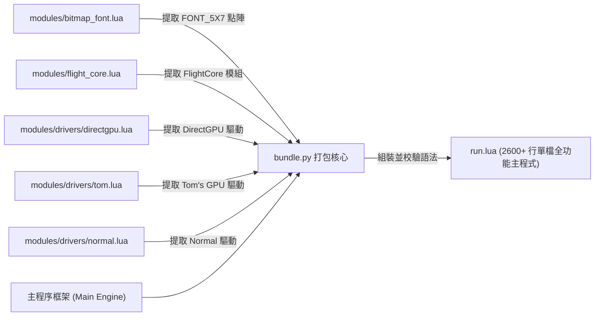

# 📖 VTOL Avionics Flight Computer 核心架構與技術手冊 (`wiki.md`)

本文檔專為開發者、工程師與架構維護者提供深入的技術指南。詳細解構專案中各模組如何分工、前後端分離架構、點陣字體渲染原理、API 介面規格，以及 `bundle.py` 如何將模組化程式碼自動編譯打包為單一獨立執行的 `run.lua`。

---

## 📑 目錄
1. [系統總覽與檔案職責](#1-系統總覽與檔案職責)
2. [前後端分離架構與呼叫流程](#2-前後端分離架構與呼叫流程)
3. [核心模組深入剖析](#3-核心模組深入剖析)
   - [3.1 點陣字體庫模組 (`bitmap_font.lua`)](#31-點陣字體庫模組-bitmap_fontlua)
   - [3.2 飛控核心大腦 (`flight_core.lua`)](#32-飛控核心大腦-flight_corelua)
   - [3.3 顯示驅動層 (`modules/drivers/*`)](#33-顯示驅動層-modulesdrivers)
4. [核心 API 規格與硬體通訊協議](#4-核心-api-規格與硬體通訊協議)
5. [自動化打包與語法校驗原理 (`bundle.py`)](#5-自動化打包與語法校驗原理-bundlepy)

---

## 1. 系統總覽與檔案職責

專案遵循高內聚、低耦合的模組化架構，將純數學物理運算、硬體 I/O 與各類螢幕的圖形渲染徹底解耦：

```text
CC-AeroAutoPilot/
├── run.lua                      # 🚀 統一主執行檔 (單檔直接執行，可由 bundle.py 編譯產出)
├── bundle.py                    # 🛠️ 模組編譯打包與語法驗證工具 (Compile & Validate)
├── wiki.md                      # 📖 深度技術規格、模組架構、API 與合併原理 (本手冊)
├── agent.md                     # 📖 開發規範、官方參考文獻與歷史規格彙整
├── README.md                    # 📖 快速上手、硬體佈線與使用者操作指南
├── turtle_startup.lua           # 🐢 動力烏龜專用啟動程式 (FL, FR, BL, BR)
├── info\                        # 📚 外部開源參考儲存庫與規格文件
└── modules\                     # 📦 模組化原始碼層
    ├── init.lua                 # 總模組載入器 (Unified Package Loader)
    ├── bitmap_font.lua          # 點陣字體庫 (ASCII 32~127 5x7 像素點陣矩陣)
    ├── flight_core.lua          # 飛控核心大腦 (PID、感測器、烏龜掃描、狀態機)
    └── drivers\                 # 前端多螢幕顯示驅動層
        ├── directgpu.lua        # CC-DirectGPU-Mod 24-bit RGB 向量圖形驅動
        ├── tom.lua              # Tom's Peripherals GPU 32-bit ARGB 點陣/向量驅動
        └── normal.lua           # CC: Tweaked 原生 Advanced Monitor & Terminal 驅動
```

### 各檔案職責矩陣

| 檔案路徑 | 職責定義 | 依賴項 | 核心輸出 |
| :--- | :--- | :--- | :--- |
| **`modules/bitmap_font.lua`** | 嵌入式點陣字型庫（Bitmap Font Library）。提供全套 ASCII 字符之微小點陣資料（5 像素寬 × 7 像素高），供任意尺寸之 GPU 螢幕渲染清晰文字。 | 無 | `FONT_5X7` 點陣資料表 |
| **`modules/flight_core.lua`** | 後端純邏輯與硬體控制核心。掌管高度 PID、陀螺儀平衡、烏龜通訊與物理狀態機。 | `peripheral`, `redstone` | `FlightCore` 單例物件與全域飛控狀態 |
| **`modules/drivers/directgpu.lua`** | DirectGPU 專屬前端驅動。支援 164×164/方塊 高解析向量繪圖與原生觸控。 | `FlightCore` | `DirectGPUDriver` |
| **`modules/drivers/tom.lua`** | Tom's GPU 專屬前端驅動。支援 ARGB 點陣文字、`lineS` 平滑刻度盤與自適應佈局。 | `FlightCore`, `bitmap_font` | `TomGPUDriver` |
| **`modules/drivers/normal.lua`** | CC 原生高級螢幕與主電腦終端機驅動。支援 16 色 `blit` 與多螢幕鏡像。 | `FlightCore` | `NormalDriver` |
| **`modules/init.lua`** | 模組化環境總入口。負責在開發階段引導載入核心與所有驅動。 | 所有子模組 | `VTOLAvionics` 主物件 |
| **`bundle.py`** | 自動化構建系統。靜態提取模組並拼裝為零依賴的單檔 `run.lua`。 | Python 3 | `run.lua` 與語法平衡報告 |

---

## 2. 前後端分離架構與呼叫流程

本專案採用 **Model-View-Controller (MVC) 變形之微核心 (Microkernel) 架構**：



### 前後端分離的關鍵設計原則
1. **單一資料來源 (Single Source of Truth)**：
   - 所有的推力計算、感測器採樣、狀態切換與烏龜通訊**僅在 `FlightCore` 內執行**。
   - 驅動層**完全不直接操作紅石或控制硬體**，僅讀取 `FlightCore.state`、`FlightCore.virtualOutputs` 與 `FlightCore.getQuadHealth()`。
2. **驅動插拔化 (Pluggable Drivers)**：
   - 每個驅動皆實作標準生命週期：
     - `init(scr, dev)`：探測螢幕解析度與初始化硬體緩衝區。
     - `render(scr)`：依據螢幕尺寸自適應渲染當前分頁（OVERVIEW, ECAM, CTRL, NAV, SYS）。
     - `handleClick(scr, x, y)`：處理點擊/觸控事件並呼叫 `FlightCore` 的控制方法。
3. **異質多螢幕並行 (Heterogeneous Multi-Display)**：
   - 主電腦可同時外接 1 個 DirectGPU、2 個 Tom's GPU 螢幕以及 3 個 Advanced Monitor，每個螢幕獨立切換分頁與互動，互不干擾。

---

## 3. 核心模組深入剖析

### 3.1 點陣字體庫模組 (`bitmap_font.lua`)

Tom's GPU 雖然具備像素繪圖能力，但原生並無中文或高品質點陣字體支援。本模組內建完整的 5x7 像素點陣字型矩陣（ASCII 32~127，代表每個英文字母寬 5 像素、高 7 像素），可應用於任意解析度之螢幕，並支援 1x 與 2x 縮放。

#### 點陣編碼原理
每個字符以 **5 個位元組（5 Bytes）** 表示 5 條縱向行（Columns），每個 Byte 的低 7 位元代表由上至下的 7 個像素點（Rows）：

```lua
-- 以字母 'A' 為例：
['A'] = {0x7C, 0x12, 0x11, 0x12, 0x7C}

-- 二進位展開：
-- Col 1: 0x7C = 01111100 (■■■■■  )
-- Col 2: 0x12 = 00010010 (  ■  ■ )
-- Col 3: 0x11 = 00010001 (  ■   ■)
-- Col 4: 0x12 = 00010010 (  ■  ■ )
-- Col 5: 0x7C = 01111100 (■■■■■  )
```

#### 解碼與繪圖演算法 (`sTxt`)
```lua
local function sTxt(x, y, text, color, scale)
    scale = scale or 1
    local curX = x
    for i = 1, #text do
        local ch = text:sub(i, i)
        local glyph = FONT_5X7[ch] or FONT_5X7['?']
        for col = 1, 5 do
            local bits = glyph[col]
            for row = 0, 6 do
                if bit32.band(bit32.rshift(bits, row), 1) == 1 then
                    if scale == 1 then
                        sP(curX + col - 1, y + row, color)
                    else
                        sFR(curX + (col - 1) * scale, y + row * scale, scale, scale, color)
                    end
                end
            end
        end
        curX = curX + (6 * scale) -- 字符間距 (5px 字符 + 1px 空隙)
    end
end
```

---

### 3.2 飛控核心大腦 (`flight_core.lua`)

`FlightCore` 封裝了完整的航空級控制邏輯：

#### 1. 四象限動力分配物理模型
飛艇設有 4 組垂直升降動力機構：
- `FL` (Front-Left, 左前)
- `FR` (Front-Right, 右前)
- `BL` (Back-Left, 左後)
- `BR` (Back-Right, 右後)

在姿態平衡計算中，引入俯仰（Pitch, $P$）與滾轉（Roll, $R$）修正量：
$$\begin{cases}
T_{FL} = T_{base} + \Delta T_{alt} + P_{pitch} + P_{roll} \\
T_{FR} = T_{base} + \Delta T_{alt} + P_{pitch} - P_{roll} \\
T_{BL} = T_{base} + \Delta T_{alt} - P_{pitch} + P_{roll} \\
T_{BR} = T_{base} + \Delta T_{alt} - P_{pitch} - P_{roll}
\end{cases}$$

#### 2. PID 高度與垂直速度雙閉環鎖定
- **外環**：高度誤差 $e_{alt} = Alt_{target} - Alt_{current}$ 計算出目標垂直速度 $V_{target}$。
- **內環**：速度誤差 $e_{v} = V_{target} - V_{current}$ 經由比例-積分-微分計算推力補償 $\Delta T_{alt}$。
- **輸出限制**：計算出的虛擬油門限制在 $0.0 \sim 15.0$，並映射至有線烏龜的 16 階紅石類比輸出（$0 \sim 15$）。

#### 3. 自動起飛基準懸停校準 (`AUTO CALIBRATE`)
當使用者觸發校準時：
1. 模式切換為 `CALIBRATING`，飛艇初始推力自 `baseThrottle = 1` 開始。
2. 系統每 0.5 秒採樣一次垂直速度 $V_{speed}$。
3. 若 $V_{speed} < 0.1 \text{ m/s}$，以 $+0.5$ 步長遞增基準推力，直到飛艇產生向上浮力。
4. 當垂直速度達到微升狀態時，精確收斂推力基準並自動切入 `HOLD_ALT` 高度鎖定模式。

---

### 3.3 顯示驅動層 (`modules/drivers/*`)

專案支援三大顯示技術，所有驅動均支援**雙尺寸自適應佈局模型 (Dual-Size Adaptive Layout)**：

| 模式名稱 | 適用解析度 / 尺寸 | 佈局策略 |
| :--- | :--- | :--- |
| **精簡模式 (Compact Mode)** | `< 5x5` 方塊 (如 3x3 螢幕, $\le 384\times 384$) | 緊湊 2 欄佈局、單排大按鈕、縮寫狀態標籤（如 `TGT:200m`、`[FL] 1/1`）。 |
| **專業全景模式 (Full Mode)** | $\ge 5x5$ 方塊 (如 5x5, 6x4, $\ge 480\times 360$) | 雙儀表盤（高度剖面卡 + 姿態動力卡）、3 排完整操作控制台、長標題與完整資訊。 |

#### 驅動技術對比



---

## 4. 核心 API 規格與硬體通訊協議

### 4.1 烏龜有線通訊協議 (`turtle_startup.lua`)
- **網路傳輸媒介**：CC: Tweaked Wired Modem + Networking Cable。
- **烏龜命名標籤**：`FL`, `FR`, `BL`, `BR`（支援小寫與後綴，例如 `turtle_fl`）。
- **遠端程序呼叫 (RPC)**：主電腦透過 CC 原生周邊包裝器直接呼叫烏龜 API：
  ```lua
  local turtlePeripheral = peripheral.wrap("turtle_0")
  -- 輸出 0~15 類比紅石至底部動力機構
  turtlePeripheral.setAnalogOutput("bottom", math.floor(pwmValue))
  ```

### 4.2 飛控核心對外呼叫 API (`FlightCore`)

```lua
-- 1. 烏龜硬體重新尋標
FlightCore.scanQuadTurtles()

-- 2. 調整目標高度 (公尺)
FlightCore.adjustTargetAlt(deltaMeters) -- e.g. +50, +10, -1, -10

-- 3. 設定指定飛行高度
FlightCore.setTargetAlt(targetMeters)  -- e.g. 0 (降落), 80, 150, 200, 300

-- 4. 鎖定當前高度
FlightCore.lockCurrentAlt()

-- 5. 微調基礎油門檔位
FlightCore.adjustBaseThrottle(deltaThrottle) -- e.g. +1.0, -1.0, +0.1, -0.1

-- 6. 啟動高度鎖定模式
FlightCore.holdAltitude()

-- 7. 啟動起飛自動校準模式
FlightCore.startCalibration()

-- 8. 緊急煞車 / 全部動力歸零
FlightCore.stopEngines()
```

---

## 5. 自動化打包與語法校驗原理 (`bundle.py`)

在 Minecraft CC: Tweaked 環境中，玩家最希望直接下載或貼上**單一 `.lua` 檔案**即可執行；然而在開發階段，多模組檔案更有利於維護。

本專案使用 `bundle.py` 解決此衝突：

### 5.1 代碼合併流程



1. **模組解包 (Strip Wrappers)**：
   - 自動移除模組頂部的 `local function safeRequire`、`package.loaded` 等檔案載入包裝。
   - 提取純淨的 Table 結構與業務函數。
2. **依賴注入與組裝**：
   - 依照依賴順序依序注入：`FONT_5X7` $\to$ `FlightCore` $\to$ `DirectGPUDriver` $\to$ `TomGPUDriver` $\to$ `NormalDriver` $\to$ `Multi-Screen Engine` $\to$ `Event Loop`。
3. **語法平衡自動校驗 (Block Balancing Validator)**：
   - 掃描產出的 `run.lua`，統計所有 Lua 區塊關鍵字：
     - 開啟關鍵字：`function`, `then`, `do`, `repeat`
     - 關閉關鍵字：`end`, `until`
   - 若區塊計數器 $\ne 0$，打包腳本將報警並指出失衡位置，確保輸出的 `run.lua` 100% 具備可執行性。

---

> [!TIP]
> 當您修改了 `modules/` 內的任何代碼，只需在終端機執行：
> ```bash
> python bundle.py
> ```
> 即可完成自動編譯、語法校驗與 `run.lua` 更新，隨後請執行 `git commit` 保存變更。
