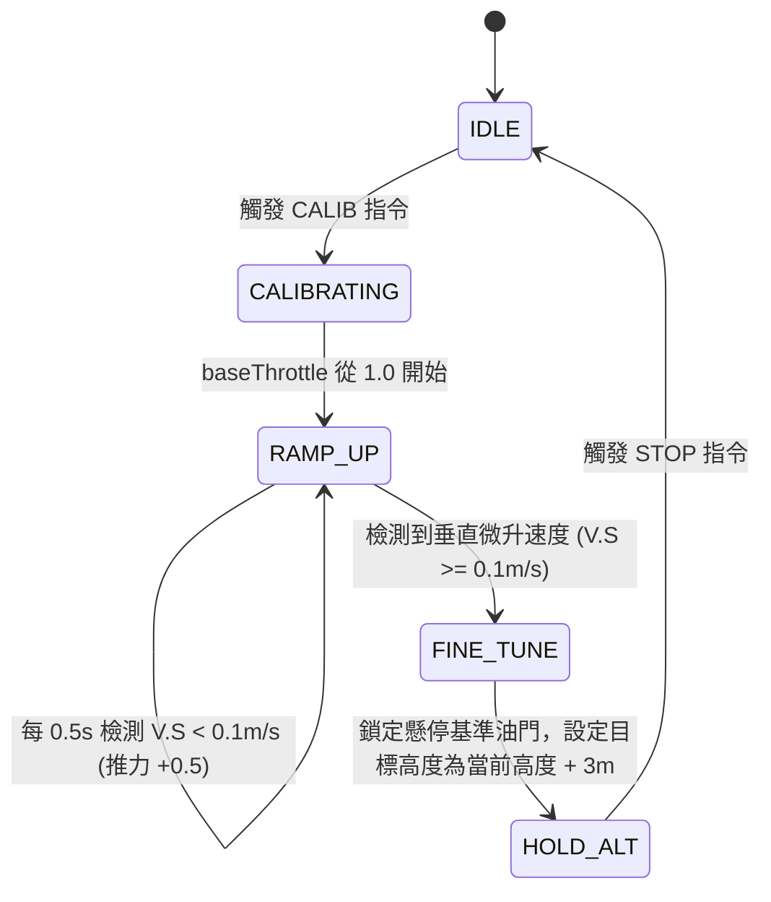
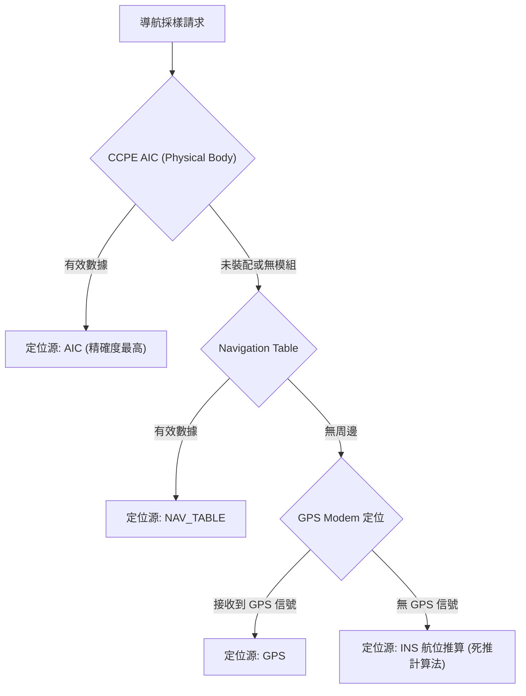
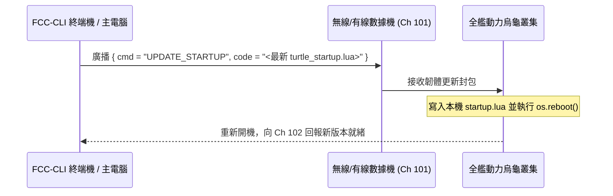

# 📖 VTOL Avionics Flight Computer 核心架構與技術規格手冊 (`wiki.md`)

本文檔專為開發者、工程師與架構維護者提供深入的技術指南。詳細解構專案中各模組如何分工、分散式節點架構、CCPE 物理實體感知整合、全向發動機叢集控制、點陣字體渲染原理、API 介面規格，以及 `bundle.py` 如何將模組化程式碼自動編譯打包為分散式發布資產。

---

## 📑 目錄
1. [系統總覽與模組職責矩陣](#1-系統總覽與模組職責矩陣)
2. [分散式節點架構與通訊協議](#2-分散式節點架構與通訊協議)
3. [飛控與動力分配演算法 (`flight_core.lua`)](#3-飛控與動力分配演算法-flight_corelua)
   - [3.1 四象限升降動力與姿態平衡數學模型](#31-四象限升降動力與姿態平衡數學模型)
   - [3.2 水平巡航與側推轉向動力分配](#32-水平巡航與側推轉向動力分配)
   - [3.3 PD-V 垂直速度阻尼與高度雙閉環控制](#33-pd-v-垂直速度阻尼與高度雙閉環控制)
   - [3.4 自動起飛懸停基準校準狀態機](#34-自動起飛懸停基準校準狀態機)
   - [3.5 航點自駕與航向引導演算法](#35-航點自駕與航向引導演算法)
4. [CCPE 物理實體感知與多源導航融合](#4-ccpe-物理實體感知與多源導航融合)
   - [4.1 `ccpe.sensor_system` API 深度整合](#41-ccpesensor_system-api-深度整合)
   - [4.2 CC:Tweaked 獨立執行環境動態載入機制](#42-cctweaked-獨立執行環境動態載入機制)
   - [4.3 多源導航融合與容錯降級機制](#43-多源導航融合與容錯降級機制)
5. [顯示驅動層與字型渲染技術](#5-顯示驅動層與字型渲染技術)
   - [5.1 5x7 ASCII 嵌入式點陣字型編碼與縮放](#51-5x7-ascii-嵌入式點陣字型編碼與縮放)
   - [5.2 DirectGPU 24-bit True RGB 向量加速驅動](#52-directgpu-24-bit-true-rgb-向量加速驅動)
   - [5.3 Tom's Peripherals GPU 32-bit ARGB 點陣/向量驅動](#53-toms-peripherals-gpu-32-bit-argb-點陣向量驅動)
   - [5.4 CC Advanced Monitor 16 色終端與多螢幕鏡像](#54-cc-advanced-monitor-16-色終端與多螢幕鏡像)
   - [5.5 雙尺寸自適應佈局模型 (Compact vs Full)](#55-雙尺寸自適應佈局模型-compact-vs-full)
6. [硬體設備清單檢測與遙測廣播](#6-硬體設備清單檢測與遙測廣播)
7. [無線 OTA 韌體遠端維護協議](#7-無線-ota-韌體遠端維護協議)
8. [自動化構建與語法校驗系統 (`bundle.py`)](#8-自動化構建與語法校驗系統-bundlepy)
9. [完整對外 API 規格清單](#9-完整對外-api-規格清單)

---

## 1. 系統總覽與模組職責矩陣

專案遵循高內聚、低耦合的模組化與微核心 (Microkernel) 架構，將純數學物理運算、硬體 I/O、遙測廣播與各類螢幕的圖形渲染徹底解耦：

```text
CC-AeroAutoPilot/
├── boot.lua                     # 🚀 通用萬能啟動器 (Release 下載 / 安裝至 startup.lua)
├── fcc.lua                      # 🧠 分散式純計算飛控大腦 (20Hz 後台運算，0% 畫面開銷)
├── display.lua                  # 🖥️ 分散式駕駛艙螢幕系統 (專職 DirectGPU / Tom's / Monitor 渲染)
├── fcc-cli.lua                  # 💻 獨立命令列終端與儀表 (雙視窗 REPL，Pocket Computer 適用)
├── run.lua                      # 📦 單機一體化主程式 (整合飛控與多螢幕渲染)
├── turtle_startup.lua           # 🐢 發動機烏龜韌體 (FL, FR, BL, BR, FWD, BWD, LEFT, RIGHT)
├── bundle.py                    # 🛠️ 模組編譯打包、版本同步與語法驗證工具
├── version.xml                  # 🏷️ 集中版本控制元數據
├── README.md                    # 📖 快速上手、硬體佈線與使用者操作指南
├── wiki.md                      # 📖 深度技術規格、模組架構、API 與物理演算法 (本手冊)
└── modules/                     # 📦 模組化原始碼層
    ├── init.lua                 # 總模組載入器 (Unified Package Loader)
    ├── bitmap_font.lua          # 點陣字體庫 (ASCII 32~127 5x7 像素矩陣)
    ├── flight_core.lua          # 飛控核心大腦 (PID、CCPE、航點、狀態機、發動機調度)
    └── drivers/                 # 前端多螢幕顯示驅動層
        ├── directgpu.lua        # CC-DirectGPU-Mod 24-bit RGB 向量圖形驅動
        ├── tom.lua              # Tom's Peripherals GPU 32-bit ARGB 點陣/向量驅動
        └── normal.lua           # CC: Tweaked 原生 Advanced Monitor & Terminal 驅動
```

### 各模組職責矩陣

| 檔案 / 模組路徑 | 職責定義 | 通訊 / 依賴 | 核心輸出 |
| :--- | :--- | :--- | :--- |
| **`fcc.lua` / `flight_core.lua`** | 後端純計算大腦。以 20Hz 執行高頻閉環 PD-V 垂直升力、CCPE 實體感知、四軸差動平衡、航點自駕計算，並透過 Ch 102 廣播 10Hz 遙測。 | `peripheral`, `redstone`, `ccpe.sensor_system` | 廣播 Telemetry、發送發動機 PWM |
| **`fcc-cli.lua`** | 獨立終端控制台。上半部即時渲染飛控儀表 (ALT, THR, HDG, POS, NAV, ENG)，下半部提供非阻塞命令列 (REPL)。 | Ch 102 (接收遙測), Ch 103 (發送指令) | 飛控指令與 OTA 廣播 |
| **`display.lua` / `drivers/*`** | 前端視覺渲染系統。接收 Ch 102 遙測封包，驅動 DirectGPU / Tom's GPU / CC Monitor 進行 6 大分頁渲染與觸控處理。 | Ch 102 (接收遙測), Ch 103 (發送指令) | 多螢幕儀表畫面與觸控事件 |
| **`turtle_startup.lua`** | 發動機節點韌體。接收 Ch 100 動力推力指令輸出紅石類比訊號，接收 Ch 101 OTA 韌體更新。 | Ch 100 (推力接收), Ch 101 (OTA 接收) | 類比紅石輸出 ($0 \sim 15$) |
| **`boot.lua`** | 萬能發布管理與開機自啟器。支援直接運行或安裝至本機 `startup.lua`。 | GitHub Releases API / Raw | 自動更新與版本維護 |

---

## 2. 分散式節點架構與通訊協議

```mermaid
flowchart TD
    subgraph CoreBrain ["FCC 飛控大腦 (fcc.lua)"]
        Sensors["CCPE 實體感知 / 高度計 / 陀螺儀"] -->|20Hz 採樣| FC["FlightCore 狀態機 & 閉環 PID"]
        FC -->|10Hz 廣播 Telemetry| Ch102["Channel 102 (Telemetry Broadcast)"]
        Ch103["Channel 103 (Command Receiver)"] -->|接收駕駛指令| FC
        FC -->|20Hz 動力計算| Ch100["Channel 100 (Engine PWM Broadcast)"]
    end

    subgraph Displays ["視覺與終端系統"]
        Ch102 -->|訂閱遙測| CDS["駕駛艙螢幕系統 (display.lua)"]
        CDS -->|點擊按鈕發送指令| Ch103
        Ch102 -->|訂閱遙測| CLI["命令列終端 (fcc-cli.lua)"]
        CLI -->|輸入指令發送指令| Ch103
    end

    subgraph Engines ["發動機烏龜叢集 (turtle_startup.lua)"]
        Ch100 -->|推力分配| T_Lift["升降烏龜 (FL, FR, BL, BR)"]
        Ch100 -->|巡航推力| T_Cruise["巡航烏龜 (FWD, BWD)"]
        Ch100 -->|側推推力| T_Steer["側推烏龜 (LEFT, RIGHT)"]
        Ch101["Channel 101 (OTA Firmware Update)"] -.->|無線遠端刷新韌體| Engines
    end
```

### 通訊頻道 (Modem Channels) 規範

1. **Channel 100 (Engine Dynamic Sync, 20Hz)**：
   - 由 FCC 向所有動力烏龜廣播。
   - 封包格式：`{ FL = 8.5, FR = 8.5, BL = 8.5, BR = 8.5, FWD = 4.0, BWD = 0.0, LEFT = 0.0, RIGHT = 0.0 }`
2. **Channel 101 (OTA Firmware & Maintenance Broadcast)**：
   - 由 FCC / FCC-CLI 向全艦烏龜廣播維護指令。
   - 指令型態：
     - `UPDATE_STARTUP`：攜帶最新 `turtle_startup.lua` 代碼字串，烏龜自動覆寫本機 `startup.lua`。
     - `REBOOT_TURTLES`：所有烏龜立即執行 `os.reboot()`。
3. **Channel 102 (Avionics Telemetry Broadcast, 10Hz)**：
   - 由 FCC 向駕駛艙螢幕 (CDS) 與終端 (FCC-CLI) 廣播完整的飛控快照。
   - 包含高度、垂直速度、航向、三軸角度、CCPE 座標、發動機健康度、航點自駕進度與設備庫存表。
4. **Channel 103 (Flight Command Uplink)**：
   - 由 CDS 觸控按鈕或 FCC-CLI 終端發送至 FCC。
   - 包含航向設定、高度調整、模式切換、航點設定 (`NAV_TO`)、硬體重掃 (`RESCAN_HW`) 等指令。

---

## 3. 飛控與動力分配演算法 (`flight_core.lua`)

### 3.1 四象限升降動力與姿態平衡數學模型

飛艇四個象限的升降推力配置如下：
- `FL` (Front-Left, 左前)
- `FR` (Front-Right, 右前)
- `BL` (Back-Left, 左後)
- `BR` (Back-Right, 右後)

姿態平衡透過俯仰（Pitch, $P$）與滾轉（Roll, $R$）引入閉環比例微分補償：
$$\begin{cases}
T_{FL} = T_{base} + \Delta T_{alt} + P_{pitch} + P_{roll} \\
T_{FR} = T_{base} + \Delta T_{alt} + P_{pitch} - P_{roll} \\
T_{BL} = T_{base} + \Delta T_{alt} - P_{pitch} + P_{roll} \\
T_{BR} = T_{base} + \Delta T_{alt} - P_{pitch} - P_{roll}
\end{cases}$$

### 3.2 水平巡航與側推轉向動力分配

系統支援將動力解耦為航向（Yaw, 偏航）、巡航（Cruise, 前後）與平移（Lateral, 左右）：
- **前進巡航 ($T_{FWD}$)**：自駕航點或手動前進時啟動，輸出至所有 `FWD` 標籤烏龜。
- **後退反推 ($T_{BWD}$)**：自駕減速或手動後退時啟動，輸出至所有 `BWD` 標籤烏龜。
- **側向推力 ($T_{LEFT}, T_{RIGHT}$)**：橫向平移時啟動，輸出至 `LEFT` / `RIGHT` 標籤烏龜。
- **偏航差動轉向 ($P_{yaw}$)**：在無側推發動機時，透過左右側垂直或推進發動機差動實現原處轉向。

### 3.3 PD-V 垂直速度阻尼與高度雙閉環控制

為徹底消除 Create: Aeronautics 物理實體的上下震盪與過衝，採用雙閉環架構：
1. **外環（高度位置環）**：
   $$V_{target} = \text{clamp}\left( K_{p,pos} \cdot (Alt_{target} - Alt_{current}), -V_{max}, +V_{max} \right)$$
2. **內環（垂直速度阻尼環）**：
   $$e_{v} = V_{target} - V_{current}$$
   $$\Delta T_{alt} = K_{p,vel} \cdot e_{v} + K_{i,vel} \int e_{v} dt + K_{d,vel} \frac{d e_v}{dt}$$
3. **最終油門飽和限制**：
   $$T_{final} = \text{clamp}(T_{base} + \Delta T_{alt}, 0.0, 15.0)$$

### 3.4 自動起飛懸停基準校準狀態機


```mermaid
stateDiagram-v2
    [*] --> IDLE
    IDLE --> CALIBRATING : 觸發 CALIB 指令
    CALIBRATING --> RAMP_UP : baseThrottle 從 1.0 開始
    RAMP_UP --> RAMP_UP : 每 0.5s 檢測 V.S < 0.1m/s (推力 +0.5)
    RAMP_UP --> FINE_TUNE : 檢測到垂直微升速度 (V.S >= 0.1m/s)
    FINE_TUNE --> HOLD_ALT : 鎖定懸停基準油門，設定目標高度為當前高度 + 3m
    HOLD_ALT --> IDLE : 觸發 STOP 指令
```

### 3.5 航點自駕與航向引導演算法

當接收到 `go <X> <Z>` 指令時，飛控大腦啟動航點引導狀態機：
1. **目標方位角計算**：
   $$\theta_{target} = \text{atan2}(Z_{wp} - Z_{curr}, X_{wp} - X_{curr}) \cdot \frac{180}{\pi}$$
2. **航向對準優先級**：
   - 若角度差 $|\Delta \theta| > 30^\circ$，飛艇優先偏航對準，限制前進推力為怠速。
   - 若角度差 $|\Delta \theta| \le 30^\circ$，逐步開啟前進推進推力 $T_{FWD} = \min(15.0, 5.0 + 0.1 \cdot \text{Dist})$。
3. **進場平滑減速**：
   - 當距離 $\text{Dist} < 3 \times \text{Radius}$ 時，前進推力線性遞減，必要時啟動 $T_{BWD}$ 反推制動。
   - 當距離 $\text{Dist} \le \text{Radius}$ 時，自駕宣告到達，航點自動清除並切回原地懸停。

---

## 4. CCPE 物理實體感知與多源導航融合

### 4.1 `ccpe.sensor_system` API 深度整合

CC Peripheral Extender (CCPE) 是專為 Create: Aeronautics 設計的航空周邊擴展模組。在飛艇裝配（Assemble）為物理實體（Contraption / Physics Body）後，CCPE 模組會將周邊感知介面掛載至 Lua 環境中。

`FlightCore` 直接提取並封裝以下原生方法：
```lua
local ss = require("ccpe.sensor_system")

-- 1. 檢測飛艇物理裝配狀態
local isContraption = ss.isOnBody() -- 返回 boolean

-- 2. 獲取世界絕對物理座標
local pos = ss.getBodyPosition() -- 返回 { x = 120.5, y = 95.2, z = -450.8 }

-- 3. 獲取三維向量速度
local vel = ss.getBodyVelocity() -- 返回 { x = 0.0, y = 1.2, z = 15.4 }

-- 4. 獲取三軸歐拉角姿態
local angles = ss.getAngles()    -- 返回 { pitch = 1.2, yaw = 89.5, roll = -0.3 }
```

### 4.2 CC:Tweaked 獨立執行環境動態載入機制

在 CC:Tweaked 中，當程式由 `load()` 或自訂 bootloader 執行時，環境變數 `_ENV` 可能不包含全域 `require` 函式。

為確保 100% 穩定相容，`FlightCore` 採用 **4 階動態解析器**：
1. **直接檢查快取**：檢查 `package.loaded["ccpe.sensor_system"]`。
2. **預載載入器調用**：檢查 `package.preload["ccpe.sensor_system"]()`。
3. **全域命名空間檢索**：檢索 `_G.ccpe.sensor_system` 與 `_G.sensor_system`。
4. **ROM 動態載入器注入**：
   若環境中無 `require`，自動透過 `dofile("/rom/modules/main/cc/require.lua").make(_ENV or _G, "/")` 動態建立標準 require 環境並載入模組。

### 4.3 多源導航融合與容錯降級機制

導航系統採用多層備援架構：

```mermaid
graph TD
    A["導航採樣請求"] --> B{"CCPE AIC (Physical Body)"}
    B -->|有效數據| B1["定位源: AIC (精確度最高)"]
    B -->|未裝配或無模組| C{"Navigation Table"}
    C -->|有效數據| C1["定位源: NAV_TABLE"]
    C -->|無周邊| D{"GPS Modem 定位"}
    D -->|接收到 GPS 信號| D1["定位源: GPS"]
    D -->|無 GPS 信號| E["定位源: INS 航位推算 (死推計算法)"]
```

---

## 5. 顯示驅動層與字型渲染技術

### 5.1 5x7 ASCII 嵌入式點陣字型編碼與縮放

`modules/bitmap_font.lua` 提供高密度嵌入式點陣字型，每個字符寬 5 像素、高 7 像素，以 5 個位元組緊湊儲存：

```lua
-- 解碼演算法：以 5 條垂直縱列 bitwise 繪製
for col = 1, 5 do
    local bits = glyph[col]
    for row = 0, 6 do
        if bit32.band(bit32.rshift(bits, row), 1) == 1 then
            drawPixel(startX + col, startY + row, color)
        end
    end
end
```

### 5.2 DirectGPU 24-bit True RGB 向量加速驅動

`modules/drivers/directgpu.lua` 對接 CC-DirectGPU-Mod：
- 支援 $164 \times 164$ 像素/方塊之極致超高解析度。
- 硬體加速 24-bit True RGB 向量繪圖指令（`drawRect`, `drawCircle`, `drawLine`, `drawTriangle`）。
- 原生支援螢幕精確像素觸控事件 (`gpu_touch`)。

### 5.3 Tom's Peripherals GPU 32-bit ARGB 點陣/向量驅動

`modules/drivers/tom.lua` 對接 Tom's GPU 模組：
- 支援 32-bit ARGB 顏色空間。
- 專屬平滑儀表刻度盤演算法（`lineS` 抗鋸齒線條與圓弧刻度）。
- 整合 5x7 點陣字型進行向量文字排版。

### 5.4 CC Advanced Monitor 16 色終端與多螢幕鏡像

`modules/drivers/normal.lua` 對接原生 CC: Tweaked 高級螢幕：
- 使用高效 `blit` 批量字元繪圖。
- 支援多螢幕自動鏡像與獨立觸控座標反算。

### 5.5 雙尺寸自適應佈局模型 (Compact vs Full)

所有驅動均自動判定螢幕尺寸並動態切換佈局：
- **精簡模式 (Compact Mode, $<5\times 5$)**：大字體、高對比、單排大按鈕、縮寫標籤。
- **全景模式 (Full Mode, $\ge 5\times 5$)**：雙即時儀表卡片（高度剖面 + 姿態動力）、3 排完整飛行管理台。

---

## 6. 硬體設備清單檢測與遙測廣播

### 6.1 設備自動探測 (`[SYS]` / `sys` / `hw`)

系統即時維護一份完整的硬體裝備庫存清單，並動態計算在線健康度：

```text
=== INSTALLED HARDWARE & SYSTEMS ===
[1] DISPLAYS & GPU HARDWARE:
    DirectGPU : YES (CC-DirectGPU HW Fast) / NO
    Screens   : Tom's GPU:1 | Native Mon:2 (Total: 3)
[2] PROPULSION ENGINE NODES:
    Lift (4-Quad): FL:1 FR:1 BL:1 BR:1 (Online: 4/4)
    Cruise Thrust: FWD:2 | BWD:1 (Online: 3/3)
    Lateral/Steer: LEFT:1 | RIGHT:1 (Online: 2/2)
[3] AVIONICS & SENSORS:
    CCPE AIC/FMC : DETECTED (ON BODY PHYSICS)
    Sensors & Net: Alti:ON | Gyro:ON | NavTab:OFF | Modems:2
    Position Fix : X:124 Y:95 Z:450 (Source: AIC)
```

### 6.2 遙測封包資料結構 (Telemetry Schema - Ch 102)

```lua
telemetry = {
    mode = "HOLD_ALT",          -- 飛控模式: IDLE / CALIBRATING / HOLD_ALT
    currentAlt = 95.2,          -- 當前高度 (m)
    targetAlt = 100.0,          -- 目標高度 (m)
    vspeed = 0.45,              -- 垂直升降速度 (m/s)
    baseThrottle = 8.5,         -- 基礎懸停油門 (0~15)
    pitch = 0.5,                -- 俯仰角 (度)
    roll = -0.2,                -- 滾轉角 (度)
    gimbalAvailable = true,     -- 陀螺儀是否在線
    quadHealth = {              -- 動力烏龜健康度
        FL = { online = 1, total = 1 },
        FR = { online = 1, total = 1 },
        BL = { online = 1, total = 1 },
        BR = { online = 1, total = 1 },
        FWD = { online = 2, total = 2 },
        BWD = { online = 1, total = 1 },
        LEFT = { online = 1, total = 1 },
        RIGHT = { online = 1, total = 1 }
    },
    nav = {                     -- 導航與自駕狀態
        x = 124.5, y = 95.2, z = 450.1,
        yaw = 89.2, speed = 12.4,
        source = "AIC",
        headingHold = true,
        targetHeading = 90.0,
        wpActive = true,
        targetX = 500.0, targetZ = 500.0, arrivalRadius = 20.0,
        diag = "Fix: X:125 Y:95 Z:450 (AIC)"
    },
    hw = {                      -- 設備庫存表
        displays = { hasDirectGpu = true, tomsCount = 1, monitorsCount = 2, totalScreens = 3 },
        engines = { ... },
        avionics = { aic = true, onBody = true, alti = true, gimbal = true, navTable = false, modems = 2 }
    }
}
```

---

## 7. 無線 OTA 韌體遠端維護協議

為免除逐一拆卸或手動更新每一隻動力烏龜的繁瑣工作，系統內建無線 OTA (Over-The-Air) 遠端刷新協議：


```mermaid
sequenceDiagram
    participant CLI as FCC-CLI 終端機 / 主電腦
    participant Air as 無線/有線數據機 (Ch 101)
    participant Turtles as 全艦動力烏龜叢集

    CLI->>Air: 廣播 { cmd = "UPDATE_STARTUP", code = "<最新 turtle_startup.lua>" }
    Air->>Turtles: 接收韌體更新封包
    Note over Turtles: 寫入本機 startup.lua 並執行 os.reboot()
    Turtles-->>CLI: 重新開機，向 Ch 102 回報新版本就緒
```

- **執行指令**：
  - `update turtles`：一鍵推送最新韌體。
  - `reboot turtles`：一鍵遠端重啟所有發動機節點。

---

## 8. 自動化構建與語法校驗系統 (`bundle.py`)

`bundle.py` 是專案的核心構建工具，具備以下自動化管線：
1. **多目標模組編譯 (Multi-Target Compilation)**：
   - 提取 `modules/` 原始碼，分別編譯產出 `run.lua` (一體化)、`fcc.lua` (純飛控大腦)、`display.lua` (螢幕系統)。
2. **版本元數據同步 (Version Synchronization)**：
   - 讀取 `version.xml`，將版本號全自動同步寫入 `fcc-cli.lua`、`boot.lua`、`turtle_startup.lua` 與所有編譯產物。
3. **區塊語法平衡驗證器 (Block Balancing Validator)**：
   - 自動掃描所有 Lua 區塊關鍵字 (`function`, `then`, `do`, `repeat`, `end`, `until`)，確保發布資產 100% 無語法缺失。

---

## 9. 完整對外 API 規格清單

### 9.1 `FlightCore` 主要方法

```lua
FlightCore.scanQuadTurtles()                   -- 掃描全艦發動機烏龜與感測器
FlightCore.setTargetAlt(meters)                 -- 設定目標高度 (m)
FlightCore.adjustTargetAlt(deltaMeters)         -- 增減目標高度 (+10, -10, +50 等)
FlightCore.lockCurrentAlt()                     -- 鎖定當前高度
FlightCore.adjustBaseThrottle(delta)            -- 調整基礎油門 (+0.1, -0.1, +1.0)
FlightCore.holdAltitude()                       -- 啟動高度鎖定模式
FlightCore.startCalibration()                   -- 啟動起飛自動校準模式
FlightCore.stopEngines()                        -- 緊急停機 (推力歸零)
FlightCore.setTargetHeading(hdg)                -- 設定目標航向角 (0~359)
FlightCore.toggleHeadingHold()                  -- 切換航向自動鎖定
FlightCore.setWaypoint(x, z, radius)            -- 設定航點自駕
FlightCore.clearWaypoint()                      -- 取消航點自駕
FlightCore.rescanHardware()                     -- 重新探測全艦硬體設備
```

---

> [!TIP]
> 任何原始碼修改後，請務必執行 `python bundle.py` 完成編譯與語法校驗，並使用 `git commit` 提交版本。
